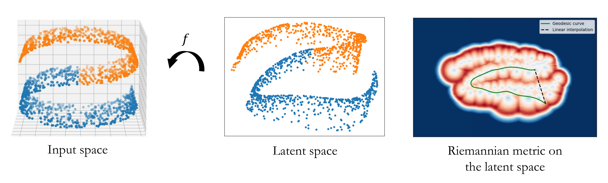

# Latent Space Oddity : On the Curvature of Deep Generative Models

    

### Project for the course [Geometric Data Analysis](https://www.jeanfeydy.com/Teaching/index.html) at Master MVA

This project provides an in-depth analysis of the paper "Latent Space Oddity: On the Curvature of Deep Generative Models". 
> Arvanitidis, G., Hansen, L. K., & Hauberg, S. (2017). Latent space oddity: on the curvature of deep generative models. arXiv preprint arXiv:1710.11379.

We explore the author’s approach of using Riemannian geometry to understand and manipulate the latent spaces of Variational Autoencoders (VAEs). The non-linearity of the generator (or decoder) of these models results in a latent space that presents a distorted representation of the input space. The study addresses this distortion by characterizing it with an approximation of a Riemannian metric that benefits from an original generator architecture designed to enhance the accuracy of variance estimates. [The report](GDA_report.pdf) examines the theoretical foundations and methodologies proposed for estimating the curvature in the latent space of these models. We further deepen our analysis through experiments showcasing the efficacy and relevance of the method, concluding with a discussion on its potential limitations.
